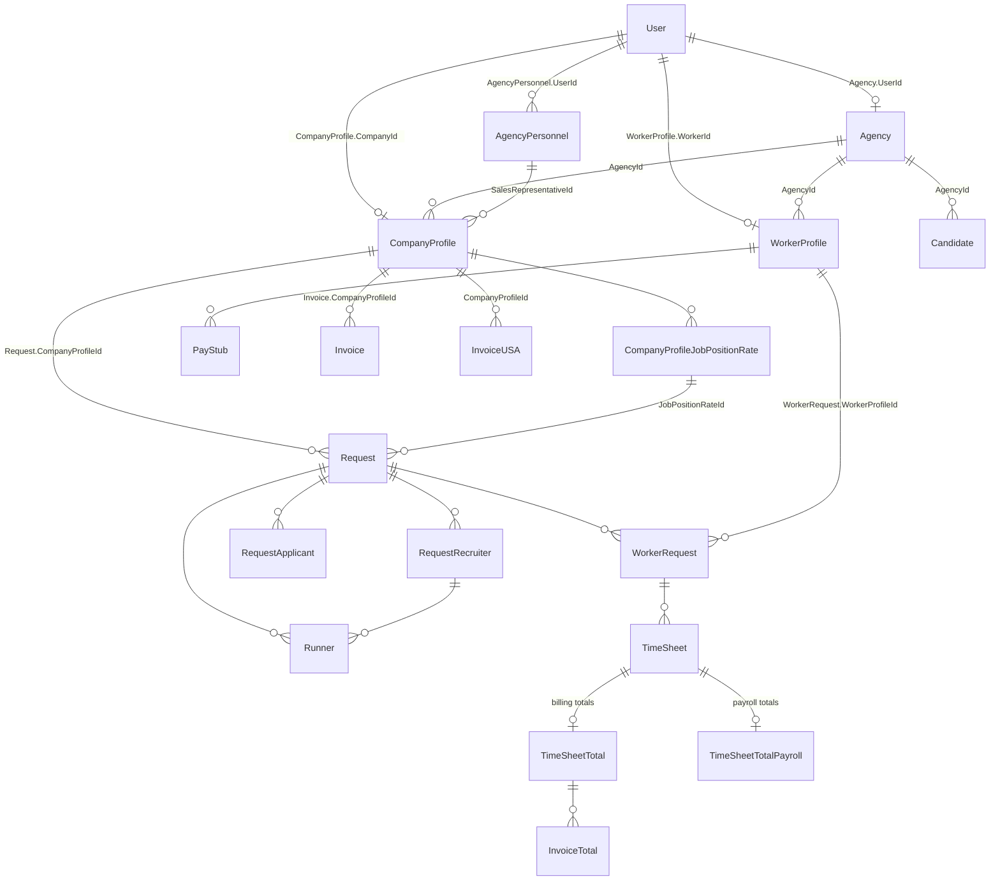

# Entities and Relationships - Covenant/Sigook Platform

Source of truth: `Covenant.Api/Covenant.Common/Entities/` (enums in `Covenant.Common/Enums/`,
EF mappings in `Covenant.Api/Covenant.Infrastructure/Configurations/`). This document gives
purpose, key fields, and relationships per entity — read the class for full member lists.
Rich entities (Request, Runner, WorkerRequest, Candidate) enforce their rules through domain
methods returning `Result`/`Result<T>` (`Covenant.Common/Functionals/`); don't mutate their
state from services when a domain method exists.

## Core relationship diagram

### The `User` anchor (critical gotcha)

`Covenant.Common/Entities/User.cs` is minimal — `Id`, `Email`, `Enabled`, `LastModified`.
Credentials and roles live in Covenant.IdentityServer (same user id). Several "obvious" FKs
point at **User**, not at the profile entity:

| FK | Points to | Not to |
|---|---|---|
| `CompanyProfile.CompanyId` | company `User` | — |
| `WorkerProfile.WorkerId` | worker `User` | — |
| `CompanyUser.UserId` | member `User` | — |
| `Agency.UserId` | agency `User` | — |
| `AgencyPersonnel.UserId` | staff `User` | — |
| `UserNotificationType.UserId` | any `User` | — |
| `Runner.CreatedBy`/`UpdatedBy`/`ChangedBy`/`RescheduledBy` | acting `User` (real audit FKs, `RunnerConfiguration.cs:45-53`) | — |

The first three are the anchors that tie a profile to its login; the rest also target `User`
directly. **Every other domain FK points at the profile, never at the `User`**:
`Request.CompanyProfileId`, `WorkerRequest.WorkerProfileId`,
`PayStub.WorkerProfileId`, `Invoice.CompanyProfileId`, `WorkerComment.WorkerProfileId` /
`.CompanyProfileId`, `CompanyUser.CompanyProfileId`. Reach profile data through the navigation
property; when a query genuinely needs the login user (notification emails, JWT scoping), go
through `Request.CompanyProfile.CompanyId` / `WorkerRequest.WorkerProfile.WorkerId`.

`Request` and `Runner` have **no** `AgencyId` of their own — the agency comes from
`Request.CompanyProfile.AgencyId`. Scope agency queries through that navigation.

### Table naming and EF configuration

**Table names are plural; entity class names are singular.** `WorkerProfile` → `WorkerProfiles`,
`Request` → `Requests`, `User` → `Users`. The `DbSet` properties on `CovenantContext` match the
table name, so `_context.Requests`, not `_context.Request` — except `PayStubHistories` /
`TimesheetHistories` (the views are singular) and `NextNumber` (keyless, mapped to the
placeholder view `view_doesnt_exitst` — typo baked into the source).

Deliberate exceptions — leave them alone:

| Table | Why |
|---|---|
| `AgencyPersonnel`, `AgencyContactInformation` | collective / uncountable |
| `PayStubHistory`, `TimesheetHistory` | views, not tables |
| `InvoicesUSA`, `CompanyProfileContactPeople` | natural plural, not the mechanical `InvoiceUSAs` / `...Persons` |
| `RequestComissions` | misspelling baked into table, entity and config filename — the only config file not named `{Entity}Configuration.cs` |
| `CompanyProfileInvoiceNotes` | entity class is already plural |

Every mapped entity has its own `IEntityTypeConfiguration<T>` in **one file per entity**
(`Configurations/{Domain}/{Entity}Configuration.cs`), and that file declares `ToTable` explicitly
— never relying on the `DbSet`-name convention. Most also declare `HasKey` (13 configs omit it
and rely on the `Id` convention), plus the entity's relationships.
Relationships are normally configured from the **dependent** side (`HasOne(...).WithMany(...)
.HasForeignKey(...)`), so each FK is declared exactly once and in the config of the entity that
owns the column. Exception: the `Request`, `Runner`, and `Candidate` configs use
`HasMany(...).WithOne(...)` from the aggregate root, because their collections are
backing-field encapsulated (`SetPropertyAccessMode(PropertyAccessMode.Field)`).

**One profile per user.** A worker belongs to exactly one agency, and so does a company:
`WorkerProfile.WorkerId` and `CompanyProfile.CompanyId` are each uniquely indexed on their own.
Never assume a user can hold profiles in several agencies — filtering by `User.Id` instead of the
profile id does not leak data across agencies, it is simply the wrong key.

The `companyId` claim in the JWT (`User.GetCompanyId()`) and the worker's `sub`
(`User.GetUserId()`) are still `User.Id`, not profile ids. Translate between the two with
`ICompanyRepository.GetCompanyProfileId(condition)`, which returns both ids in either direction.

`UserType` enum (`Covenant.Common/Enums/UserType.cs`): `Worker=1, Company, CompanyUser,
AgencyPersonnel, Agency, Candidate`.

---

## Agency domain — `Entities/Agency/`

### Agency (`Agency.cs`)

The staffing agency (tenant root). Key fields: `Id`, `NumberId`, `UserId` → User, `FullName`,
`HstNumber`, `BusinessNumber`, `AgencyType` (`Master=1, Regular=2, BusinessPartner=3` —
`Enums/AgencyType.cs`), `AgencyParentId` (self-FK for sub-agencies), `RecruitmentEmail`, `Logo`
(CovenantFile). Children: `Locations` (AgencyLocation), `ContactInformation`, `WsibGroup`.
Computed `BillingAddress` = first location with `IsBilling`.

### AgencyLocation / AgencyContactInformation / AgencyWsibGroup

Join/child tables: `AgencyLocation` links Agency↔Location with `IsBilling`;
`AgencyWsibGroup` links to `WsibGroup.cs` (WSIB insurance classification).

### AgencyPersonnel (`AgencyPersonnel.cs`)

Staff member of an agency: `Id`, `AgencyId`, `UserId` → User, `Name`, `IsPrimary`. **There is no
`PersonnelType` field** — what a person can do is determined by their IdentityServer role
(recruiting/sales/admin). Referenced by `CompanyProfile.SalesRepresentativeId` (sales portfolio)
and `RequestRecruiter.RecruiterId` (weekly board). Unique index `(AgencyId, UserId)`.

---

## Company domain — `Entities/Company/`

### CompanyProfile (`CompanyProfile.cs`)

The client company, always owned by an agency. Key fields:

- Identity: `Id`, `NumberId`, `CompanyId` → User, `AgencyId`, `FullName`
- Sales: `CompanyStatus` (`Lead=1, Potential, Prospect, Quoted, Client, Blocked, Inactive=7` —
  `Enums/CompanyStatus.cs`), `SalesRepresentativeId` → AgencyPersonnel
- Billing/payroll behavior: `PaidHolidays`, `OvertimeStartsAfter` (TimeSpan, default 44h,
  minimum 40h), `RequiredPaymentMethod`
- Access: `RequiresPermissionToSeeRequests`, `Active`
- Misc: `Industry` (CompanyProfileIndustry), `VaccinationRequired(+Comments)`, `About`,
  `InternalInfo`, audit fields

Unique index on `CompanyId` — one profile per company.

### CompanyProfileJobPositionRate (`CompanyProfileJobPositionRate.cs`)

**Drives all pricing.** Fields: `JobPosition` (string), `Rate` (the AgencyRate billed to the
company), `WorkerRate` (paid to the worker; must be ≤ `Rate`, both 0.01–1000),
`WorkerRateMin`/`WorkerRateMax`, `OvertimeStartsAfter` (nullable per-position override),
`ShiftId` → Shift, `Description`, `IsDeleted` (soft delete). Markup = `Rate − WorkerRate`.
There are **no** night-shift/holiday/overtime multiplier columns and no `Currency` column here —
multipliers come from global `Covenant.Common/Configuration/Rates.cs` config at
invoice/pay-stub time.

### CompanyProfile children

| Entity | Purpose / key fields |
|---|---|
| `CompanyProfileLocation` | Company↔Location + `IsBilling` |
| `CompanyProfileContactPerson` | contact: name parts, `Position`, `MobileNumber`, `OfficeNumber(+Ext)`, `Email` |
| `CompanyProfileDocument` | Company↔CovenantFile + `DocumentType` (`Enums/CompanyProfileDocumentType.cs`), audit |
| `CompanyProfileIndustry` | `IndustryId` (catalog) or free-text `OtherIndustry` |
| `CompanyProfileInvoiceNotes` | `HtmlNotes` printed on invoices |
| `CompanyProfileInvoiceRecipient` | extra invoice email recipients: `Email`, `Name` |
| `CompanyProfileNote` | Company↔CovenantNote (shared note entity with soft delete) |
| `CompanyUser` | additional company-side login: `CompanyProfileId` → CompanyProfile (owner), `UserId` → User (member), `Name`, `Lastname`, `Position`, `MobileNumber`. Unique `(CompanyProfileId, UserId)`. Gotcha: `Id == UserId` (the ctor sets `Id = user.Id`), so a user can hold only one CompanyUser row globally |

---

## Worker domain — `Entities/Worker/`

### WorkerProfile (`WorkerProfile.cs`)

Registered worker, owned by an agency. Key fields:

- Identity: `Id`, `NumberId` (sequential — **canonical source for the worker number on pay stubs
  and reports**), `WorkerId` → User, `AgencyId`; unique index on `WorkerId` — one profile per worker
- Person: `FirstName`/`MiddleName`/`LastName`/`SecondLastName` (computed `FullName`), `BirthDay`,
  `GenderId`, `HasVehicle`, `LocationId`
- SIN: `SocialInsurance` (+ `MaskedSocialInsurance`), `SocialInsuranceExpire`, `DueDate`,
  `SocialInsuranceFileId`
- Documents: two identification slots (`IdentificationNumber1/2` + type + file),
  `PoliceCheckBackGround`, `Resume`, `OtherDocuments`
- Status flags: `ApprovedToWork` (gate to be assignable), `Dnu` (do not use),
  `IsSubcontractor`, `IsContractor`, `PunchCardId`, `ExternalId`, `WcCode`
- Emergency/health: `ContactEmergency*`, `HealthProblem` fields

Child collections (all `WorkerProfile{X}.cs` in the same folder): Skills, Languages, Licenses,
Certificates, JobExperiences, Availabilities/AvailabilityDays/AvailabilityTimes,
LocationPreferences, Notes, OtherDocuments.

### WorkerProfileTaxCategory (`WorkerProfileTaxCategory.cs`)

Per-worker tax claim codes (`Enums/TaxCategory.cs`) used by payroll deduction lookups;
subcontractor categories zero out CPP/EI/tax. PK is `WorkerProfileId` (true 1:1 with cascade
delete); also carries `Cpp`/`Ei` override columns.

### WorkerProfileHoliday (`WorkerProfileHoliday.cs`)

Links a worker to a public `Holiday` for not-worked stat-holiday pay eligibility. Unique
`(WorkerProfileId, HolidayId)`.

### WorkerComment (`WorkerComment.cs`)

Comments about a worker visible to agency/company (see Agency/Company WorkerComment controllers).

---

## Candidate domain — `Entities/Candidate/`

Pre-registration prospect managed by recruiters — no `User`, no login, minimal data.

### Candidate (`Candidate.cs`)

`Id`, `NumberId` (long), `AgencyId`, `Name`, `Email`, `Address`, `PostalCode`, `GenderId`,
`HasVehicle`, `SourceId` → Source (where the candidate came from), `Recruiter` (string),
`ResidencyStatus`, `Dnu`, `CreatedAt`. Domain methods `AddSkill`/`AddPhone`/`AddEmail`
(duplicate-skill guard, phone required).

Children:

| Entity | Shape |
|---|---|
| `CandidatePhone` | `Id`, `CandidateId`, `PhoneNumber` |
| `CandidateSkill` | `Id`, `CandidateId`, `Skill` (created via `CandidateSkill.Create`) |
| `CandidateDocument` | join Candidate↔`CovenantFile` (`CandidateId`, `DocumentId`) |
| `CandidateNote` | join Candidate↔`CovenantNote` (`CandidateId`, `NoteId`) |

A Candidate reaches a job order through `RequestApplicant`, which references the candidate by FK —
personal data is never copied. Runners are worker-only: a candidate must be converted to a worker
(`CandidateService.ConvertToWorker`) before entering the recruiting pipeline.

---

## Request domain — `Entities/Request/`

### Request (`Request.cs`)

A job order. Key fields:

- `Id`, `NumberId`, `CompanyProfileId` → CompanyProfile (navigation `CompanyProfile`; the agency
  comes from `CompanyProfile.AgencyId` — `Request` has no `AgencyId`)
- Job: `JobTitle`, `BillingTitle`, `JobCosting` (admin/superadmin only in the UI), `Description`,
  `Requirements`, `InternalRequirements`, `Responsibilities`, `JobLocationId` → Location,
  `JobIsOnBranchOffice`
- Rates: `JobPositionRateId` → CompanyProfileJobPositionRate, plus per-request overrides
  `WorkerRate`/`AgencyRate`/`WorkerSalary`
- Capacity: `WorkersQuantity` (min 1), `WorkersQuantityWorking` (derived from booked workers)
- Timing: `StartAt`, `FinishAt`, `IsAsap`, `DurationTerm` (`LongTerm=0, ShortTerm=1`),
  `EmploymentType` (`FullTime=1, PartTime, Contractor, Temporary`), `ShiftId` → Shift,
  `DurationBreak` (max 1h), `BreakIsPaid`, `HolidayIsPaid` (default true),
  `PunchCardOptionEnabled`
- Extras: `Incentive(+Description)`, `UsesRunners` (bool, default true),
  `InvitationSentItAt` (resend throttle: 7 days), `CreatedBy`

**`Status` (`RequestStatus`: `Open=1, Filled=3, Cancelled=4`) is the single source of truth —
there is no `IsOpen` flag.** Transitions happen only inside `AddWorker`, `RejectWorker`,
`Cancel`, `Open`, `IncreaseWorkersQuantityByOne`, `DecreaseWorkersQuantityByOne`. Full rules:
[REQUEST_STATE_MANAGEMENT.md](../business/REQUEST_STATE_MANAGEMENT.md).

Child/related entities in the same folder: `RequestNote`, `RequestSkill`, `RequestReportTo`,
`RequestRequestedBy`, `RequestCompanyUser` (which company users may see the request),
`RequestComission`, `RequestCancellationDetail`, `RequestFinalizationDetail`
(+ root-level `ReasonCancellationRequest`, whose `Value` is a plain English `string` — it used
to point at a multi-language `StringResource` row, now deleted). Migration
`20260731002342_PluralizeTableNames` dropped three tables: `CompanyProfileHoliday`,
`StringResource`, `TimeSheetPhoto` — holiday eligibility is now worker-side only
(`WorkerProfileHoliday`).

### WorkerRequest (`WorkerRequest.cs`)

Assignment of a worker to a request. `Id`, `RequestId`, `WorkerProfileId` → **WorkerProfile**,
`WorkerRequestStatus` (`Enums/WorkerRequestStatus.cs`: **`Rejected = 2`, `Booked = 3`** — there
is no value 1), `StartWorking`, `WeekStartWorking` (computed Sunday of the start week),
`CreatedBy`/`RejectedBy`/`RejectedAt`/`RejectComments`, `LimitDateToAddTimeSheet`
(= RejectedAt + 1 month). Owns the `TimeSheets` collection and `WorkerRequestNote`s. Rebooking a
rejected worker reuses the same row (`Book()` clears rejection fields). Unique
`(RequestId, WorkerProfileId)` (`WorkerRequestConfiguration.cs`).

### RequestApplicant (`RequestApplicant.cs`)

Someone who applied/was submitted to a request: `RequestId` + **either** `WorkerProfileId`
**or** `CandidateId` (mutually exclusive — factories `CreateWithWorker` / `CreateWithCandidate`),
`CreatedBy`, `Comments`. Managed by `Controllers/Sigook/Agency/Requests/ApplicantsController.cs`;
`RequestApplicantConsumer` reacts to new-applicant bus messages.

### RequestSource (`RequestSource.cs`)

M:N Request↔`Source` (job board posting), composite PK `(RequestId, SourceId)`. Only sources
with `Source.IsAvailableForRequests = true` are selectable as job boards
(`GET api/Catalog/source/requests`).

### RequestRecruiter (weekly board)

`RequestRecruiter.cs`: assigns an `AgencyPersonnel` recruiter to a request, optionally for one
`WorkDate` (day cell on the recruiting weekly board). Max 10 recruiters per request per day;
unique `(RequestId, RecruiterId, WorkDate)`. Managed through `Request.AddRecruiter` /
`RemoveRecruiter` / `MoveRecruiterAssignment` and `WeeklyBoardService` /
`Controllers/Sigook/Agency/Recruiting/WeeklyBoardController.cs`.

The people a recruiter sends under an assignment are **Runners** (`RequestRecruiter.Runners`,
FK `Runner.RequestRecruiterId`, `ON DELETE SET NULL`). The old `WorkerDispatch` entity was
replaced by `Runner` in migration `RunnersWorkerOnlyAndBoardRunners`.

### Runner (`Entities/Request/Runners/`)

Recruiting pipeline for a worker actively submitted to one request. `Runner.cs`:
`Id`, `NumberId` (long), `RequestId`, `WorkerProfileId` (required — runners are
worker-only; candidates cannot be runners), `RequestRecruiterId` (nullable — set when the runner
is sent from the weekly board, null when created from the order's Runners tab),
`Type` (`RunnerType`: `Active=1` applied on own initiative, `Passive=2` sourced),
`Status` (`RunnerStatus`, stored as **text** via `EnumToStringConverter`:
`SentToClient=1, InterviewScheduled, InterviewRescheduled, NoLongerAvailable, NoShow,
WaitingForInterviewFeedback, WaitingForFinalDecision, Rejected, InOnboardingProcess, Hired=10`),
`StartDate` (required and set only when hiring), `CreatedBy`/`UpdatedBy` (acting user Guid).

Entity-enforced constraints:

- Created as `SentToClient` with an initial `RunnerStatusHistory` row; every status change
  **appends** a history row (never overwrites).
- Any→any transitions allowed, **except `Hired` is terminal**; moving to `Hired` requires
  `StartDate`.
- Same worker cannot be a runner twice on one request (`IRunnerRepository.RunnerExists`).
- Interviews (`RunnerInterview.cs`: `ScheduledDate`, `InterviewType` Phone/Video/Onsite,
  `Interviewer`, `InterviewStatus` Scheduled/Rescheduled, `Feedback`, `RescheduleCount`) can be
  added/rescheduled only in `InterviewScheduled`/`InterviewRescheduled`; rescheduling
  auto-transitions to `InterviewRescheduled`.

API: `Controllers/Sigook/Agency/Requests/RunnersController.cs`
(`api/agency/requests/{requestId}/Runners`). Business narrative: WORKFLOWS.md §6.

---

## Timesheet entities — `Entities/Request/`

### TimeSheet (`TimeSheet.cs`)

One worker-day. `WorkerRequestId` FK; one row per `(WorkerRequest, Date)` (guarded by
`WorkerRequest.AddTimeSheet`).

- Punch card: `ClockIn`/`ClockOut` + `ClockInRounded`/`ClockOutRounded` (3-min wait to clock
  out, 5-min re-clock-out window)
- Normalized: `TimeIn`/`TimeOut` (same-date normalization — see class doc comment)
- Agency approval: `TimeInApproved`/`TimeOutApproved`
- Flags/adjustments: `IsHoliday`, `MissingHours`/`MissingHoursOvertime` +
  `MissingRateWorker`/`MissingRateAgency`, `DeductionsOthers`, `BonusOrOthers`,
  `Reimbursements` (each with a `*Description`), `Comment`

### TimeSheetTotal vs TimeSheetTotalPayroll

Two parallel 1:1 hour-breakdown rows per timesheet, same shape (`ITimeSheetTotal`):
`TotalHours`, `RegularHours`, `OtherRegularHours`, `OvertimeHours`, `NightShiftHours`,
`HolidayHours`, `AccumulateWeekHours` (weekly OT accumulator).

- `TimeSheetTotal` — **billing** hours; consumed by `InvoiceTotal`/`InvoiceUSATimeSheetTotal`.
- `TimeSheetTotalPayroll` — **payroll** hours; consumed by `PayStubWageDetail`. Unique on
  `TimeSheetId`.

Night shift is deprecated: `NightShiftHours` exists but pay stubs and invoices compute it as 0.

Also: `TimesheetHistory` (keyless read model for a worker's timesheet history view).

---

## Accounting — `Entities/Accounting/`

### PayStub (`Accounting/PayStub/PayStub.cs`)

Weekly pay stub for a worker. `WorkerProfileId` FK, `NumberId` (long), `PayStubNumber`
(**string**), `PayStubNumberId`, `Position`, period (`DateWorkBegins`/`DateWorkEnd`,
`PaymentDate`, `WeekEnding`), earnings (`RegularWage`, `GrossPayment`, `Vacations` — 4% Canada,
`TotalEarnings`), deductions (`Cpp`, `Ei`, `FederalTax`, `ProvincialTax`, `TotalDeductions`),
`TotalPaid`. The worker's display number comes from `WorkerProfile.NumberId`, not from PayStub.
PDFs are cached in blob storage — regenerate after render changes.

| Child | Purpose |
|---|---|
| `PayStubItem` | line item: `Description`, `Quantity`, `UnitPrice`, `Total`, `Type` (`Enums/PayStubItemType.cs`: `Regular=0, OtherRegular, Overtime, StatutoryHoliday, StatutoryWorkedHoliday, NightShift, Missing, MissingOvertime, Vacations, Other, Reimbursement=10`) |
| `PayStubWageDetail` | per-timesheet wage amounts (`Regular`, `OtherRegular`, `Overtime`, `Holiday`, `Missing`, `MissingOvertime`, `NightShift`, `WorkerRate`), FK `TimeSheetTotalId` → **TimeSheetTotalPayroll** |
| `PayStubPublicHoliday` | not-worked stat holiday paid on the stub: `Holiday` date + `Amount` (created via `Create`, amount ≥ 0) |
| `PayStubOtherDeduction` | extra deduction line: `Quantity`, `UnitPrice`, `Total`, `Description` |

`PayStubHistory` (`PayStubHistory.cs`) is a **keyless entity mapped to the `PayStubHistory`
view** (`Configurations/Accounting/PayStubHistoryConfiguration.cs`: `HasNoKey().ToView(...)`) —
a read model for pay-stub listings, not a table.

### Invoice — Canada (`Accounting/Invoice/Invoice.cs`)

Weekly invoice to a company. `CompanyProfileId` FK → CompanyProfile (navigation
`CompanyProfile`; renamed in migration `20260730001645_ProfileForeignKeys`), `NumberId`,
`InvoiceNumber` (long; displayed as `AI-{number:0000}-{yy}` via `BuildInvoiceNumber`), `Email`,
`WeekEnding`, totals (`SubTotal`, `Hst`, `TotalNet`), snapshot rates (`NightShiftRate` — always
written 0, `HolidayRate`, `OverTimeRate`, `VacationsRate`, `HstRate`, `BonusRate`). Note:
`VacationsRate`/`BonusRate` are stored but never enter invoice totals — vacation pay is a
pay-stub concept; HST is a single global config rate, not per-province.

| Child | Purpose |
|---|---|
| `InvoiceTotal` | per-timesheet billing line: FK `TimeSheetTotalId` → TimeSheetTotal, `AgencyRate`, amounts (`Regular`, `OtherRegular`, `Overtime`, `Holiday`, `Missing`, `MissingOvertime`, `NightShift`), `TotalGross`/`TotalNet`/`Total` |
| `InvoiceHoliday` | not-worked stat holiday billed to the company: `Holiday` date, `Hours`, `Amount`, optional `WorkerProfileId` |
| `InvoiceDiscount` | discount line (`Quantity`, `UnitPrice`, `Amount`, `Description`) |
| `InvoiceAdditionalItem` | extra billed item (`Quantity`, `UnitPrice`, computed `Total`) |
| `InvoiceAdditionalDetail` | `ClientSiteAddress`; shared with USA invoices (`CanadaInvoiceId` XOR `UsaInvoiceId`) |

`SkipPayrollNumber.cs` — payroll numbers to skip when generating sequences.

### InvoiceUSA (`Accounting/Invoice/InvoiceUSA.cs`)

US-company invoice (selected by `InvoiceServiceFactory` when the agency billing location is in
the USA). `CompanyProfileId` FK (same shape as Canada's), `InvoiceNumber` (string,
prefix `US`) + `InvoiceNumberId` (both unique-indexed), `SubTotal`, `Tax`, `TotalNet`,
`HtmlNotes`, bill-to/bill-from address blocks. Children: `InvoiceUSAItem` (same amount breakdown
as `InvoiceTotal`, optional `TimeSheetTotalId`), `InvoiceUSADiscount`, and
`InvoiceUSATimeSheetTotal` (join InvoiceUSA↔TimeSheetTotal, since USA items may be free-form).

### Subcontractor reports (`Accounting/Subcontractor/`)

Pay-stub equivalent for `WorkerProfile.IsSubcontractor` workers (no CPP/EI/tax):
`ReportSubcontractor` (`WorkerProfileId`, `RegularWage`, `PublicHolidayPay`, `Gross`,
`Earnings`, `TotalNet`, `DeductionOthers`, period/`WeekEnding`, `NumberId`) with children
`ReportSubcontractorWageDetail`, `ReportSubcontractorPublicHoliday`,
`ReportSubContractorOtherDeduction` (only lines with `Total > 0` are kept).

### Deduction tables (`Entities/Accounting/Deductions/`)

Row-per-earnings-range lookup tables loaded from CRA data, consolidated into two entities:
`CppDeduction` (table `CppDeductions`) and `TaxDeduction` (table `TaxDeductions`). Both carry a
`PayPeriod` discriminator (`Weekly`, `BiWeekly`, `SemiMonthly`, `Monthly`); `TaxDeduction` adds
`TaxType` (`Federal`, `Provincial`). Deductions are **range lookups by earnings/year, not
formulas**; EI is the only computed one. Non-unique lookup indexes: `CppDeduction`
`(Year, PayPeriod, From, To)`, `TaxDeduction` `(Year, PayPeriod, TaxType, From, To)`.
`TaxDeduction`'s `Cc0`–`Cc10` claim-code columns are selected by
`WorkerProfileTaxCategory.FederalCategory`/`ProvincialCategory` (`TaxCategory` enum,
`Cc0=1`…`Cc10=11`).

---

## Shared entities (root of `Entities/`)

| Entity | Purpose |
|---|---|
| `Location.cs` | address: `Address`, `CityId` → City, `PostalCode`, `Entrance`, `MainIntersection`, `Latitude`/`Longitude`, `LocationTax`; `IsUSA` is a null-conditional navigation chain (`City?.Province?.Country?.Code`) — a missing `Include` of City.Province.Country silently yields `false` → Canadian invoice for a US company |
| `City.cs` / `Province.cs` / `Country.cs` | geo catalogs; `Province.Code` = "ON"/"BC"/…, `Country.Code` = "CA"/"USA" (3 letters for USA — asymmetric; `Location.IsUSA` compares to "USA", so comparing to "US" never matches). Canonical values are the static factories `Country.Canada`/`Country.UnitedStates` — there is no `CovenantConstants.Country` class. `ProvinceSetting.cs` holds per-province config |
| `Holiday.cs` | public holidays: `Date` (unique index), `Description`, `CountryCode` |
| `CovenantFile.cs` | file metadata for blobs (referenced by all `*Document` join entities) |
| `CovenantNote.cs` | shared note entity with author/soft-delete (used by Candidate/Company/Request notes) |
| `Source.cs` | catalog of candidate/job-board sources; `IsAvailableForRequests` gates job-board use; `Value` unique |
| `Shift.cs` | shift definition attached to job position rates and requests |
| `Gender.cs`, `Language.cs`, `IdentificationType.cs`, `Lift.cs`, `Day.cs`, `Availability*` | catalogs |
| `WsibGroup.cs` | WSIB classification catalog |
| `User.cs` | see [User anchor](#the-user-anchor-critical-gotcha) |
| `Notification/` | `NotificationType`, `UserNotificationType` (per-user notification prefs); `NotificationType.Id` is a hand-assigned `int` — the only non-Guid PK |

---

## Verified unique indexes

From `Covenant.Infrastructure/Configurations/` (`HasIndex(...).IsUnique()`):

| Entity | Index |
|---|---|
| User | `Email` |
| Holiday | `Date` |
| Source | `Value` |
| CompanyProfile | `CompanyId` |
| WorkerProfile | `WorkerId` |
| AgencyPersonnel | `(AgencyId, UserId)` |
| CompanyUser | `(CompanyProfileId, UserId)` |
| WorkerRequest | `(RequestId, WorkerProfileId)` |
| RequestRecruiter | `(RequestId, RecruiterId, WorkDate)` |
| WorkerProfileHoliday | `(WorkerProfileId, HolidayId)` |
| TimeSheetTotalPayroll | `TimeSheetId` |
| InvoiceUSA | `InvoiceNumber`; `InvoiceNumberId` |
| UserNotificationType (table `UserNotificationTypes`) | `(UserId, NotificationTypeId)` |

Non-unique example: `Runner.RequestId` (`Configurations/Request/Runners/RunnerConfiguration.cs`).
For anything else, check the entity's configuration class before assuming an index exists.
